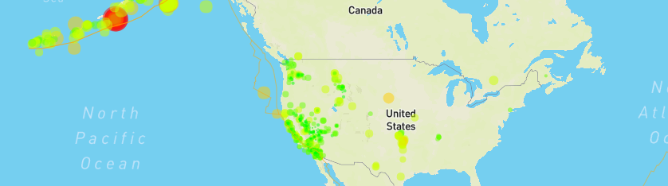

# Earthquakes
---------

## Geographical data visualization of global sismic activity in the last 7 days.
#### *Project created as part of GWU Data Analytics course.*
> Leaflet, Mapbox, HTML, JavaScript

* Earthquake data retrieved from the [USGS GeoJSON Feed](https://earthquake.usgs.gov/earthquakes/feed/v1.0/geojson.php).
* Maps generated using Mapbox and Leaflet.
* Tectonic plates layer generated using [Tectonic Plates](https://github.com/fraxen/tectonicplates).

#### [Demo](https://jmendiola84.github.io/Earthquakes-Map)
